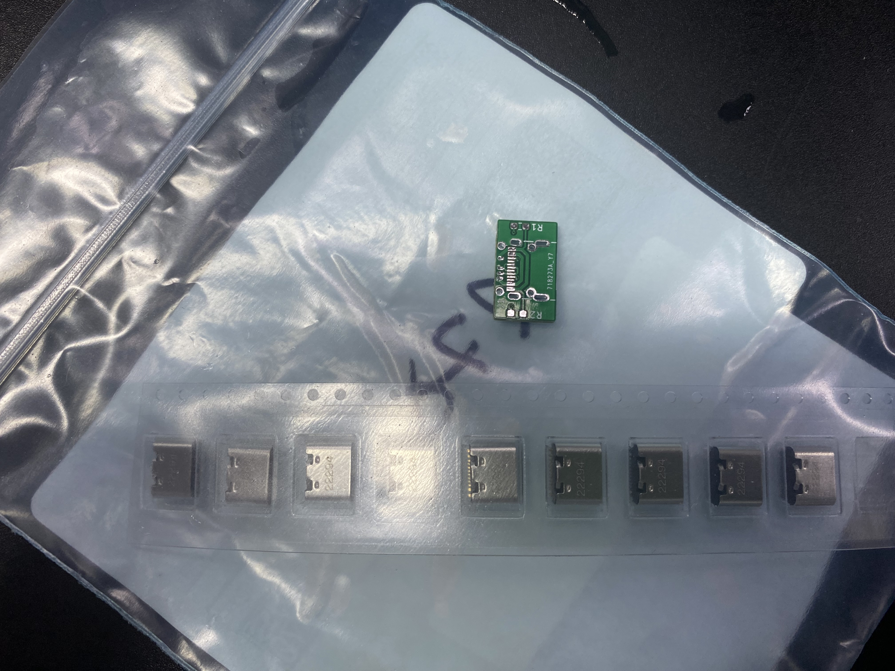
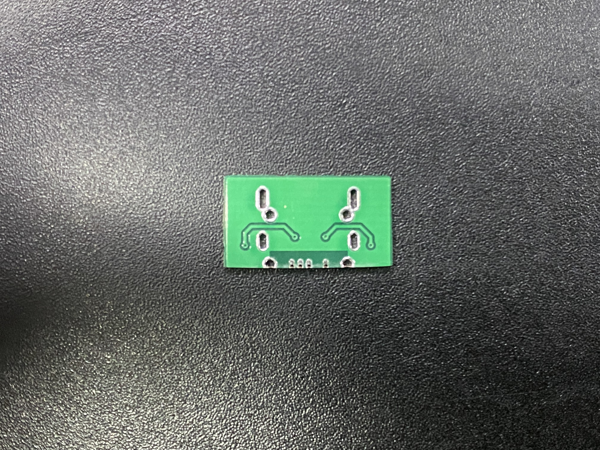
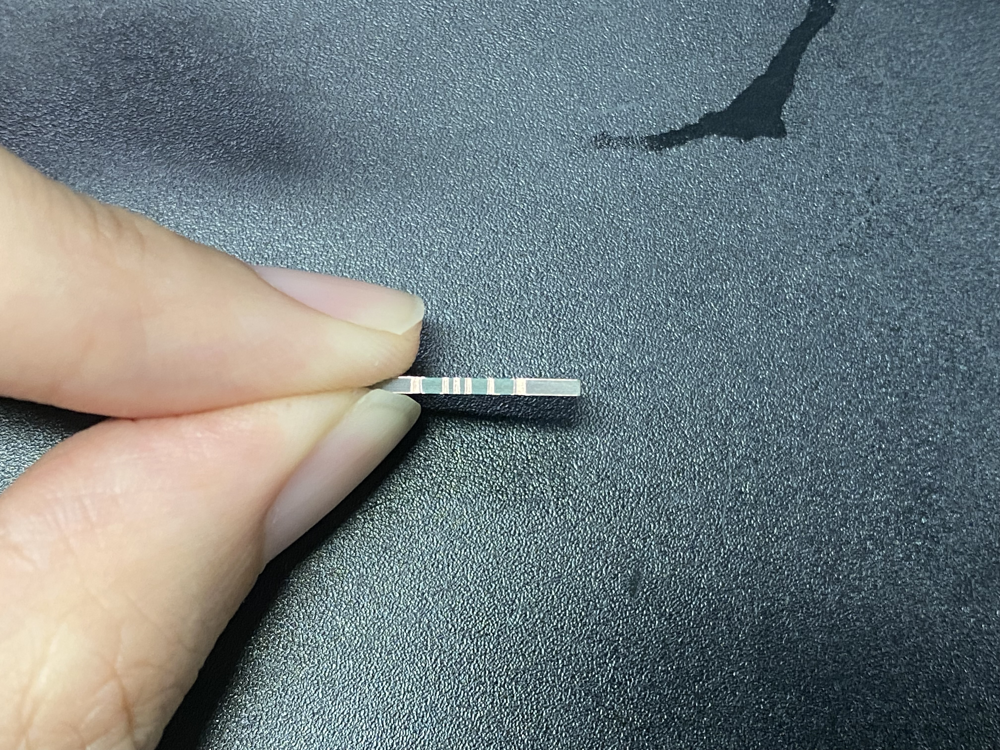
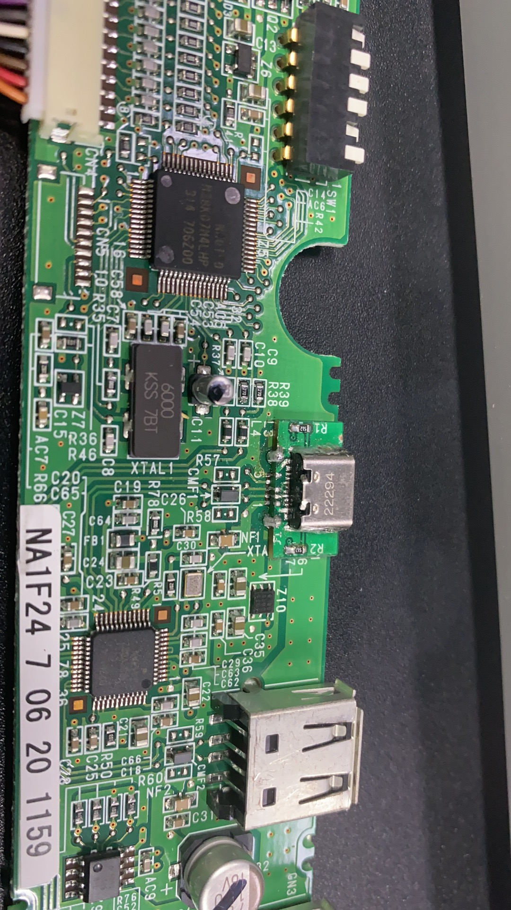
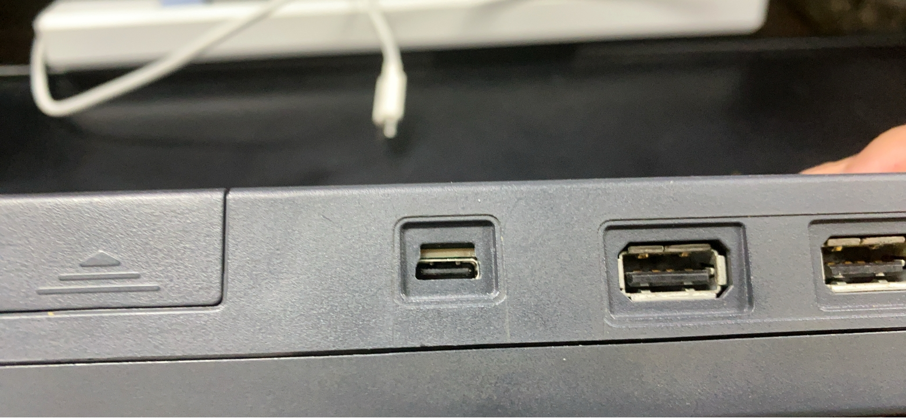

# HHKBUSB2TYPEC

Change HHKB Pro2 USB from MINI-B to TPYE C

1. I confirm that the USB Mini-B model used on the HHKB is HRS UX60-MB-5S8
2. I would like to use Molex 2171790001 as a replacement for the original USB, while minimizing any damage to the existing structure
~~3. Using a PCB thickness of 1.2mm, there may be a 0.2mm gap that needs to be adjusted using tape~~
3. sing a PCB thickness of 1.2mm is a bit thick. It is possible to use a PCB with a thickness of 1.0mm
4. To save costs, we need to use PCB with a regular process and modify the half-hole boards with sandpaper

The current project is in testing phase, and I have already produced the PCB and purchased the materials.

***

## Raw Materials

## Adjust PCB

use sandpaper to adjust the PCB

## Soldering

## Assembly

Use sandpaper to enlarge the outer shell holes slightly and proceed with the assembly.

